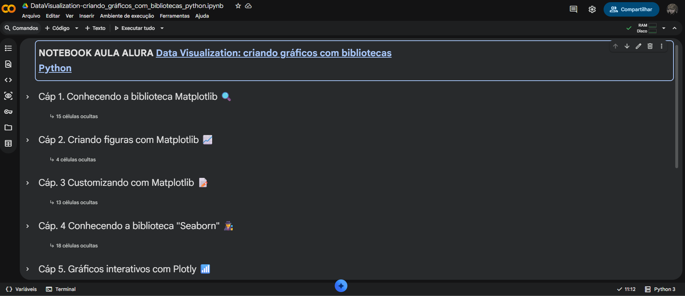
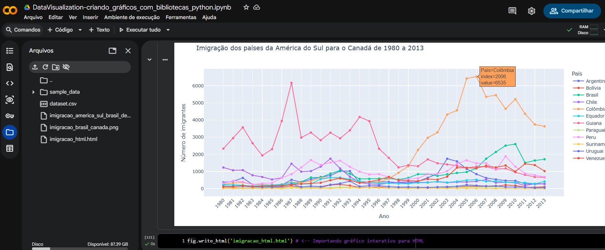
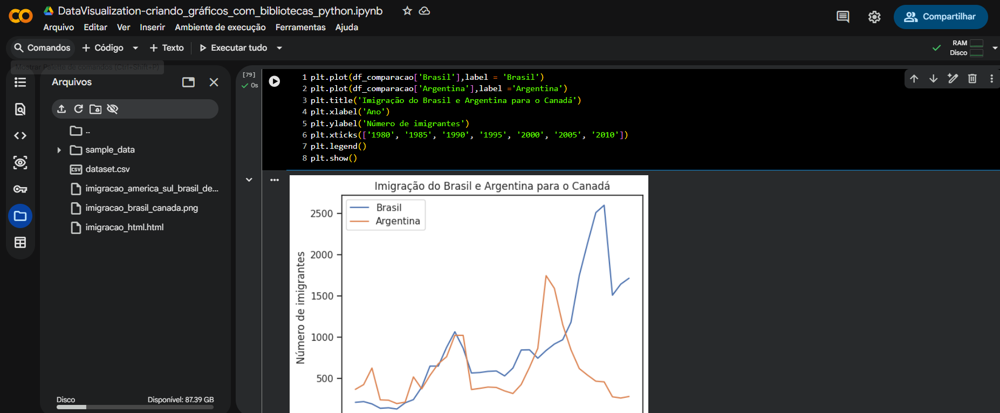

# 🚀 Data Visualization: criando gráficos com bibliotecas Python - Alura 🎲

Bem-vindo ao meu repositório aonde eu guardo meu notebook feito ao decorrer do curso: **Data Visualization: criando gráficos com bibliotecas Python** da Alura! 🎓

Aqui você encontrará um notebook no qual realizei exercícios práticos e aprimorei minhas habilidades em Data Science, com foco em **Python** para **Data Science** e suas bibliotecas. 🐍📚



## *Oque você verá?**
- Gráficos analiticos com dados reais sobre imigrantes;
- Diferentes tipos de visualizações dos gráficos;
- Linhas de código comentadas informando oque cada sintaxe faz;

## 🛠️ Tecnologias Utilizadas

* **Python** 🐍
  - Pandas
  - Seaborn
  - Matplotlib
  - Numpy
* **Google Collab Notebooks** 📝



## 🚀 Como Rodar:

**Clone o repositório:**

   ```bash
   git clone https://github.com/mateus-henriquee/DataVisualization-criando_graficos_com_bibliotecas_python
   ```

   *OU...*
  - **Entre atráves do link do colab: [https://colab.research.google.com/drive/1X8EPuGA6iIapZ9_012V_WXNSbm81nSUX?usp=sharing]([https://colab.research.google.com/drive/1X8EPuGA6iIapZ9_012V_WXNSbm81nSUX?usp=sharing](https://colab.research.google.com/drive/1uGNVGMPGYpbh66SsR-XyZbiYm1z9INvi?usp=sharing))**

**NOTEBOOK 💻:**
1. **Execute as linhas de código uma por uma ou rode tudo de uma vez** 😄
   

---



## 💬 **Contato**

Se você tiver dúvidas ou sugestões, sinta-se à vontade para abrir uma ou me enviar um e-mail:

📧 [mateush.leccese@gmail.com](mailto:mateush.leccese@gmail.com)

---

**🐍  🚀**
